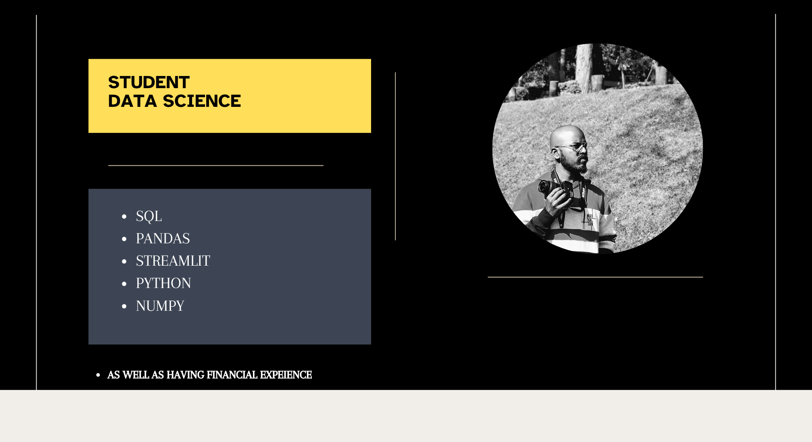

### Hi Everyone 🫶

**This is Narayana ✅**
- <i>Currently:</i> Data Science student at Guvi. 
- <i>Education:</i> I am MBA graduate.

<b><em>TOP REPO </em></b>  
  

  

    
    
  

<b><em>STATS:</em></b>  

  

  <b><em>GitHub Stats:</em></b>  
       
  

<b><em>TOP LANGUAGE:</em></b>  

<b><em>Point of Contacting:</em></b>  
  
 <a href="<https://www.linkedin.com/in/narayana-ram-sekar-b689a9201/>"></a>
<!--
**Narennrs1/Narennrs1** is a ✨ _special_ ✨ repository because its `README.md` (this file) appears on your GitHub profile.

Here are some ideas to get you started:

- 🔭 I’m currently working on ...
- 🌱 I’m currently learning ...
- 👯 I’m looking to collaborate on ...
- 🤔 I’m looking for help with ...
- 💬 Ask me about ...
- 📫 How to reach me: ...
- 😄 Pronouns: ...
- ⚡ Fun fact: ...
-->
